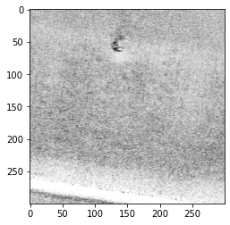
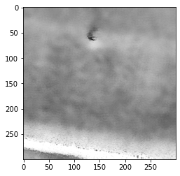
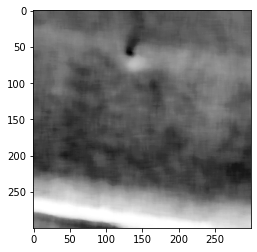
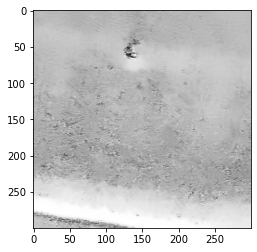
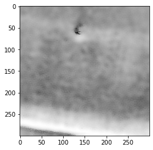

.. _code_directive:

-------------------------------------

Denoise
''''''''''

Images can be corrupted by noise. To suppress and improve the image analysis various filtering techniques have been developed.
Denoising the image is very usefull before the detection of peaks.
In ``findpeaks`` we incorporated some well-known filtering methods: *Frost*, *Lee*, and *Kuan*, but also other methods such as *fastnl*, *bilateral*, *mean* and *median* filters.
Some of the methods are adopted from ``pyradar`` [1], for which the code is refactored and rewritten for Python 3. Other methods are adopted from ``python-opencv``.

It is generally known that noise can follow various distributions, and requires different approaches to effectly reduce the noise.

.. |figD8| image:: ../figs/noise_distr_examples.png

.. table:: Noise distributions
   :align: center

   +----------+
   | |figD8|  |
   +----------+

*SAR* and *SONAR* images are affected by *speckle* noise that inherently exists in and which degrades the image quality.
It is caused by the back-scatter waves from multiple distributed targets. It is locally strong and it increases the mean Grey level of local area.
Reducing the noise enhances the resolution but tends to decrease the spatial resolution too.

Lets demonstrate the denoising by example. First we will import the example data:

.. code:: python
    
    # Import library
    import matplotlib.pyplot as plt
    from findpeaks import findpeaks
    # Import image example
    img = fp.import_example('2dpeaks_image')
    import findpeaks
    
    # filters parameters
    # window size
    winsize = 15
    # damping factor for frost
    k_value1 = 2.0
    # damping factor for lee enhanced
    k_value2 = 1.0
    # coefficient of variation of noise
    cu_value = 0.25
    # coefficient of variation for lee enhanced of noise
    cu_lee_enhanced = 0.523
    # max coefficient of variation for lee enhanced
    cmax_value = 1.73
    
    # Some pre-processing
    # Resize
    img = findpeaks.stats.resize(img, size=(300,300))
    # Make grey image
    img = findpeaks.stats.togray(img)
    # Scale between [0-255]
    img = findpeaks.stats.scale(img)
    # Plot
    plt.imshow(img, cmap='gray_r')

.. table:: RAW Sonar image
   :align: center

   +----------+
   | |figDO|  |
   +----------+

Lee
----------------------------------------------------

The Additive Noise Lee Despeckling Filter can be used with the function: :func:`findpeaks.filters.lee.lee_filter`

Let's assume that the despeckling noise is additive with a constant mean of zero, a constant variance, and drawn from a Gaussian distribution. Use a window (I x J pixels) to scan the image with a stride of 1 pixels (and I will use reflective boundary conditions).
The despeckled value of the pixel in the center of the window located in the ith row and jth column is, zhat_ij = mu_k + W*(z_ij = mu_z), where mu_k is the mean value of all pixels in the window centered on pixel i,j, z_ij is the unfiltered value of the pixel, and W is a weight calculated as, W = var_k / (var_k + var_noise), where var_k is the variance of all pixels in the window and var_noise is the variance of the speckle noise.
A possible alternative to using the actual value of the center pixel for z_ij is to use the median pixel value in the window. The Lee methods assumes noise mean = 0. 

The parameters of the filter are the window/kernel size and the variance of the noise (which is unknown but can perhaps be estimated from the image as the variance over a uniform feature smooth like the surface of still water). Using a larger window size and noise variance will increase radiometric resolution at the expense of spatial resolution [3].
Note that the Lee filter may not behave well at edges because for any window that has an edge in it, the variance is going to be much higher than the overall image variance, and therefore the weights (of the unfiltered image relative to the filtered image) are going to be close to 1.

.. code:: python

    # lee filter
    image_lee = findpeaks.lee_filter(img, win_size=winsize, cu=cu_value)
    # Plot
    plt.imshow(image_lee, cmap='gray_r')

.. |figD0| image:: ../figs/sonar_lee.png

.. table:: Lee filtering
   :align: center

   +----------+
   | |figD0|  |
   +----------+

Lee enhanced
----------------------------------------------------

:func:`findpeaks.filters.lee_enhanced.lee_enhanced_filter`

.. code:: python

    # lee enhanced filter
    image_lee_enhanced = findpeaks.lee_enhanced_filter(img, win_size=winsize, k=k_value2, cu=cu_lee_enhanced, cmax=cmax_value)
    # Plot
    plt.imshow(image_lee_enhanced, cmap='gray_r')

.. table:: Lee enhanced filtering
   :align: center

   +----------+
   | |figD1|  |
   +----------+

Kuan
----------------------------------------------------

:func:`findpeaks.filters.kuan.kuan_filter`

.. code:: python

    # kuan filter
    image_kuan = findpeaks.kuan_filter(img, win_size=winsize, cu=cu_value)
    # Plot
    plt.imshow(image_kuan, cmap='gray_r')

.. |figD2| image:: ../figs/sonar_kuan.png

.. table:: Kuan filtering
   :align: center

   +----------+
   | |figD2|  |
   +----------+

Frost
----------------------------------------------------

:func:`findpeaks.filters.frost.frost_filter`

.. code:: python

    # frost filter
    image_frost = findpeaks.frost_filter(img, damping_factor=k_value1, win_size=winsize)
    # Plot
    plt.imshow(image_frost, cmap='gray_r')

.. table:: Frost filtering
   :align: center

   +----------+
   | |figD3|  |
   +----------+

Mean
----------------------------------------------------

:func:`findpeaks.filters.mean.mean_filter`

.. code:: python

    # mean filter
    image_mean = findpeaks.mean_filter(img.copy(), win_size=winsize)
    # Plot
    plt.imshow(image_mean, cmap='gray_r')

.. |figD4| image:: ../figs/sonar_mean.png

.. table:: Mean filtering
   :align: center

   +----------+
   | |figD4|  |
   +----------+

Median
----------------------------------------------------

:func:`findpeaks.filters.median.median_filter`

.. code:: python
    
    # median filter
    image_median = findpeaks.median_filter(img, win_size=winsize)
    # Plot
    plt.imshow(image_median, cmap='gray_r')

.. table:: Median filtering
   :align: center

   +----------+
   | |figD5|  |
   +----------+

Fastnl
----------------------------------------------------

:func:`findpeaks.utils.stats.denoise`

.. code:: python
    
    # fastnl
    img_fastnl = findpeaks.stats.denoise(img, method='fastnl', window=winsize)
    # Plot
    plt.imshow(img_fastnl, cmap='gray_r')

.. table:: Fastnl filtering
   :align: center

   +----------+
   | |figD6|  |
   +----------+

Bilateral
----------------------------------------------------

The bilateral filter, :func:`findpeaks.utils.stats.denoise`, uses a Gaussian filter in the space domain, but it also uses one more (multiplicative) Gaussian filter component which is a function of pixel intensity differences.
The Gaussian function of space makes sure that only pixels are ‘spatial neighbors’ are considered for filtering,
while the Gaussian component applied in the intensity domain (a Gaussian function of intensity differences)
ensures that only those pixels with intensities similar to that of the central pixel ("intensity neighbors")
are included to compute the blurred intensity value. As a result, this method preserves edges, since for pixels lying near edges,
neighboring pixels placed on the other side of the edge, and therefore exhibiting large intensity variations when compared to the central pixel, will not be included for blurring.

.. code:: python
    
    # bilateral
    img_bilateral = findpeaks.stats.denoise(img, method='bilateral', window=winsize)
    # Plot
    plt.imshow(img_bilateral, cmap='gray_r')

.. table:: Bilateral filtering
   :align: center

   +----------+
   | |figD7|  |
   +----------+

References
----------
    * [1] https://github.com/PyRadar/pyradar
    * [2] https://opencv-python-tutroals.readthedocs.io/en/latest/py_tutorials/py_imgproc/py_filtering/py_filtering.html
    * [3] http://desktop.arcgis.com/en/arcmap/10.3/manage-data/raster-and-images/speckle-function.htm

