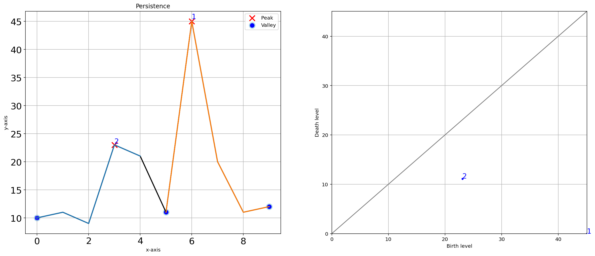

Quick Examples
''''''''''''''''

1D-vector
-------------------------------------

Find peaks in low sampled dataset
^^^^^^^^^^^^^^^^^^^^^^^^^^^^^^^^^^^^^^^

.. code:: python

	# Load library
	from findpeaks import findpeaks
	# Data
	X = [9,60,377,985,1153,672,501,1068,1110,574,135,23,3,47,252,812,1182,741,263,33]
	# Initialize
	fp = findpeaks(lookahead=1)
	results = fp.fit(X)
	# Plot
	fp.plot()

.. image:: ../figs/fig1_raw.png
  :width: 600

Interpolation
^^^^^^^^^^^^^^^^^^^^^^^^^^^^^^^^^^^^^^^^^

.. code:: python

	# Initialize with interpolation parameter
	fp = findpeaks(lookahead=1, interpolate=10)
	results = fp.fit(X)
	fp.plot()

.. image:: ../figs/fig1_interpol.png
  :width: 600

Comparison peak detection methods (1)
^^^^^^^^^^^^^^^^^^^^^^^^^^^^^^^^^^^^^^^

.. code:: python

	# Load library
	from findpeaks import findpeaks
	# Data
	X = [10,11,9,23,21,11,45,20,11,12]
	# Initialize
	fp = findpeaks(method='peakdetect', lookahead=1)
	results = fp.fit(X)
	# Plot
	fp.plot()

	fp = findpeaks(method='topology', lookahead=1)
	results = fp.fit(X)
	fp.plot()
	fp.plot_persistence()

.. |ex3| image:: ../figs/fig2_peakdetect.png

.. table:: Comparison methods
   :align: center

   +----------+----------+
   | |ex3|    | |ex4|    |
   +----------+----------+

.. image:: ../figs/fig2_persistence.png
  :width: 600

Comparison peak detection methods (2)
^^^^^^^^^^^^^^^^^^^^^^^^^^^^^^^^^^^^^^^

.. code:: python

	# Initialize with interpolate parameter
	fp = findpeaks(method='peakdetect', lookahead=1, interpolate=10)
	results = fp.fit(X)
	fp.plot()

	fp = findpeaks(method='topology', lookahead=1, interpolate=10)
	results = fp.fit(X)
	fp.plot()

.. |ex5| image:: ../figs/fig2_peakdetect_int.png
.. |ex6| image:: ../figs/fig2_topology_int.png

.. table:: Comparison methods
   :align: center

   +----------+----------+
   | |ex5|    | |ex6|    |
   +----------+----------+

Find peaks in high sampled dataset
^^^^^^^^^^^^^^^^^^^^^^^^^^^^^^^^^^^^^^^

.. code:: python

	# Load library
	import numpy as np
	from findpeaks import findpeaks

	# Data
	i = 10000
	xs = np.linspace(0,3.7*np.pi,i)
	X = (0.3*np.sin(xs) + np.sin(1.3 * xs) + 0.9 * np.sin(4.2 * xs) + 0.06 * np.random.randn(i))

	# Initialize
	fp = findpeaks(method='peakdetect')
	results = fp.fit(X)
	# Plot
	fp.plot1d()

	fp = findpeaks(method='topology', limit=1)
	results = fp.fit(X)
	fp.plot1d()
	fp.plot_persistence()

.. |ex7| image:: ../figs/fig3.png
.. |ex8| image:: ../figs/fig3_topology.png

.. table:: Comparison methods
   :align: center

   +----------+----------+
   | |ex7|    | |ex8|    |
   +----------+----------+

.. image:: ../figs/fig3_persistence_limit.png
  :width: 600

2D-array (image) 
---------------------------------------------------

Find peaks using default settings
^^^^^^^^^^^^^^^^^^^^^^^^^^^^^^^^^^^^^^^

The input image:

.. image:: ../figs/plot_example.png
  :width: 600

.. code:: python

	# Import library
	from findpeaks import findpeaks

	# Import example
	X = fp.import_example()
	print(X)
	# array([[0. , 0. , 0. , 0. , 0. , 0. , 0. , 0. , 0.4, 0.4],
	#        [0. , 0. , 0. , 0. , 0. , 0. , 0.7, 1.4, 2.2, 1.8],
	#        [0. , 0. , 0. , 0. , 0. , 1.1, 4. , 6.5, 4.3, 1.8],
	#        [0. , 0. , 0. , 0. , 0. , 1.4, 6.1, 7.2, 3.2, 0.7],
	#        [..., ..., ..., ..., ..., ..., ..., ..., ..., ...],
	#        [0. , 0.4, 2.9, 7.9, 5.4, 1.4, 0.7, 0.4, 1.1, 1.8],
	#        [0. , 0. , 1.8, 5.4, 3.2, 1.8, 4.3, 3.6, 2.9, 6.1],
	#        [0. , 0. , 0.4, 0.7, 0.7, 2.5, 9. , 7.9, 3.6, 7.9],
	#        [0. , 0. , 0. , 0. , 0. , 1.1, 4.7, 4. , 1.4, 2.9],
	#        [0. , 0. , 0. , 0. , 0. , 0.4, 0.7, 0.7, 0.4, 0.4]])

	# Initialize
	fp = findpeaks(method='mask')
	# Fit
	fp.fit(X)

	# Plot the pre-processing steps
	fp.plot_preprocessing()
	# Plot all
	fp.plot()

	# Initialize
	fp = findpeaks(method='topology')
	# Fit
	fp.fit(X)

The masking approach detects the correct peaks.

.. code:: python

	fp.plot()

.. image:: ../figs/2dpeaks_mask.png
  :width: 600

Conversion from 2d to 3d mesh plots looks very nice. But there is a rough surface because of the low-resolution input data.

.. code:: python

	fp.plot_mesh()

.. |ex9| image:: ../figs/2dpeaks_mesh1.png
.. |ex10| image:: ../figs/2dpeaks_mesh2.png

.. table:: Comparison methods
   :align: center

   +----------+----------+
   | |ex9|    | |ex10|   |
   +----------+----------+

The persistence plot appears to detect the right peaks.

.. code:: python

	fp.plot_persistence()

.. image:: ../figs/2dpeaks_pers.png
  :width: 600

Find peaks with pre-processing
^^^^^^^^^^^^^^^^^^^^^^^^^^^^^^^^^^^^^^^

.. code:: python

	# Import library
	from findpeaks import findpeaks

	# Import example
	X = fp.import_example()

	# Initialize
	fp = findpeaks(method='topology', scale=True, denoise=10, togray=True, imsize=(50,100))

	# Fit
	results = fp.fit(X)

	# Plot all
	fp.plot()
	
	# Plot preprocessing
	fp.plot_preprocessing()

.. |ex11| image:: ../figs/2dpeaks_raw.png
.. |ex12| image:: ../figs/2dpeaks_interpolate.png
.. |ex13| image:: ../figs/2dpeaks_raw_processed.png

.. table:: Comparison methods
   :align: center

   +----------+----------+----------+
   | |ex11|   | |ex12|   |  |ex13|  |
   +----------+----------+----------+

The masking does not work so well because the pre-processing steps includes some weighted smoothing which is not ideal for the masking approach.

.. code:: python
	
	fp.plot()

.. image:: ../figs/2dpeaks_mask_proc.png
  :width: 600

The mesh plot has higher resolution because the pre-processing steps caused some smoothing.

.. code:: python
	
	fp.plot_mesh()

.. |ex14| image:: ../figs/2dpeaks_meshs1.png
.. |ex15| image:: ../figs/2dpeaks_meshs2.png

.. table:: Comparison methods
   :align: center

   +----------+----------+
   | |ex13|   | |ex14|   |
   +----------+----------+

The Persistence plot does show the detection of correct peaks.

.. code:: python

	fp.plot_persistence()

.. image:: ../figs/2dpeaks_perss.png
  :width: 600

.. include:: add_bottom.add