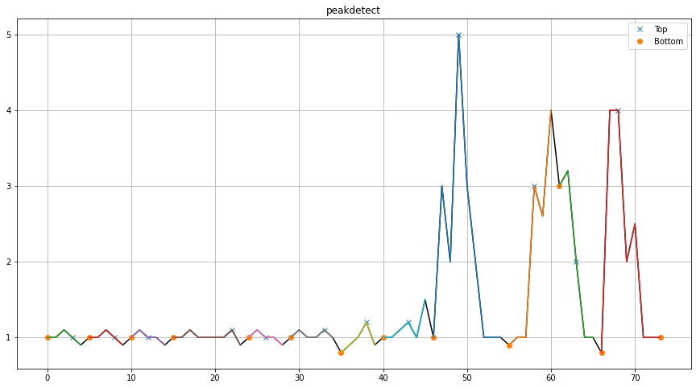
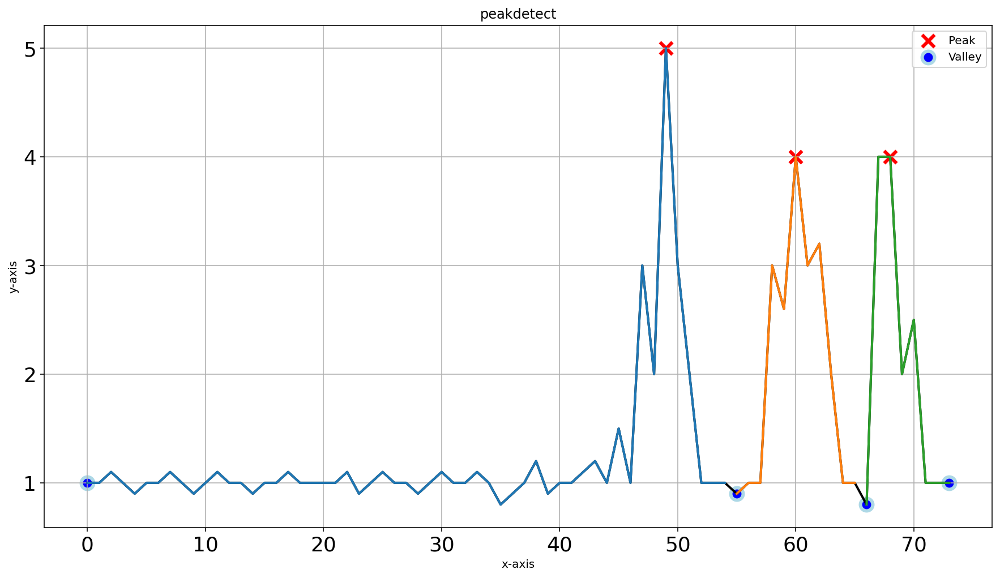

.. _code_directive:

-------------------------------------

Performance
'''''''''''

Lets compare the methods with some data and see how they behave in peak detection.

Comparison peak detection in one-dimensional data
----------------------------------------------------

Small dataset
^^^^^^^^^^^^^

For the first scenario we will create a dataset containing some small peaks and some larger ones.
We will detect peaks using the topology and peakdetect method with and without interpolation.

.. code:: python

    # Import library
    from findpeaks import findpeaks
    # peakdetect
    fp_peakdetect = findpeaks(method='peakdetect', interpolate=None, lookahead=1)
    # peakdetect with interpolation
    fp_peakdetect_int = findpeaks(method='peakdetect', interpolate=10, lookahead=1)
    # topology
    fp_topology = findpeaks(method='topology', interpolate=None)
    # topology with interpolation
    fp_topology_int = findpeaks(method='topology', interpolate=10)

    # Example 1d-vector
    X = [1,1,1.1,1,0.9,1,1,1.1,1,0.9,1,1.1,1,1,0.9,1,1,1.1,1,1,1,1,1.1,0.9,1,1.1,1,1,0.9,1,1.1,1,1,1.1,1,0.8,0.9,1,1.2,0.9,1,1,1.1,1.2,1,1.5,1,3,2,5,3,2,1,1,1,0.9,1,1,3,2.6,4,3,3.2,2,1,1,0.8,4,4,2,2.5,1,1,1]

    # Fit the methods on the 1d-vector
    results_1 = fp_peakdetect.fit(X)
    results_2 = fp_peakdetect_int.fit(X)
    results_3 = fp_topology.fit(X)
    results_4 = fp_topology_int.fit(X)

    # Plot
    fp_peakdetect.plot()
    fp_peakdetect_int.plot()
    fp_topology.plot()
    fp_topology_int.plot()

A visual look of the results for the peakdetect with and without interpolation. Note that the interpolated results are readily mapped back to the original plot.

.. table:: Peakdetect results without interpolation (left) and with (right)
   :align: center

   +---------+---------+
   | |fig8|  | |fig9|  |
   +---------+---------+

The differences become clear with and without the use of interpolation

.. |fig10| image:: ../figs/1dpeaks_perf_topology.png

.. |fig11| image:: ../figs/1dpeaks_perf_topology_int.png

.. table:: Topology results without interpolation (left) and with (right)
   :align: center

   +----------+----------+
   | |fig10|  | |fig11|  |
   +----------+----------+

The four approaches results in various diffent peaks and valleys. A simple comparison, by means of a confusion matrix shows that the *interpolation* results in the detection of similar peaks and valleys.

Peaks detected between peakdetect vs topology using interpolation show only 4 differences in detection of peaks.

.. code:: python

          True  False
    True  [45,  1]
    False [ 3, 25]
       

A comparison between peakdetect vs topology without interpolation show 20 differences in detection of peaks.

.. code:: python

          True  False
    True  [48,  13]
    False [ 7,  6 ]

Large dataset
^^^^^^^^^^^^^^

For this scenario we create a large dataset to detect peaks using *peakdetect* and *topology*.

.. code:: python

    # Import library
    from findpeaks import findpeaks
    # Initialize peakdetect
    fp1 = findpeaks(method='peakdetect', lookahead=200)
    # Initialize topology
    fp2 = findpeaks(method='topology')

    # Example 1d-vector
    i = 10000
    xs = np.linspace(0,3.7*np.pi,i)
    X = (0.3*np.sin(xs) + np.sin(1.3 * xs) + 0.9 * np.sin(4.2 * xs) + 0.06 * np.random.randn(i))

    # Fit using peakdetect
    results_1 = fp1.fit(X)
    # Fit using topology
    results_2 = fp2.fit(X)

    # Plot peakdetect
    fp1.plot()
    # Plot topology
    fp2.plot()
    fp2.plot_persistence()

The topology methods detects thousands of local minima and maxima whereas the peakdetect approach finds the correct ones.

.. |fig3| image:: ../figs/fig3.png

.. table:: Peakdetect on a large noisy dataset
   :align: center

   +---------+
   | |fig3|  |
   +---------+

The homology-persistence plots can help to filter the thousands of hits that are mostly alongside the diagonal and therefore not of interest.
Only a few points seems to be of interest; numbers one to eight.

.. |fig12| image:: ../figs/fig_persistence_largedataset.png

.. table:: Topology on a large noisy dataset
   :align: center

   +----------+
   | |fig12|  |
   +----------+

Lets select the top 8 datapoints and plot them:

.. code:: python

    import matplotlib.pyplot as plt

    I = (results_2['df']['rank'].values<=8) & (results_2['df']['rank'].values>0)
    results_2['df'].loc[I, :]

    plt.figure(figsize=(15,8))
    plt.plot(results_2['df']['x'], results_2['df']['y'], '.')
    plt.plot(results_2['df']['x'].loc[I], results_2['df']['y'].loc[I], 'or')
    plt.grid(True)

.. |fig13| image:: ../figs/fig3_topology_tophits.png

.. table:: Topology with filter on top 8 hits
   :align: center

   +----------+
   | |fig13|  |
   +----------+
