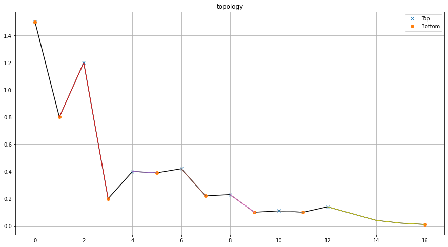
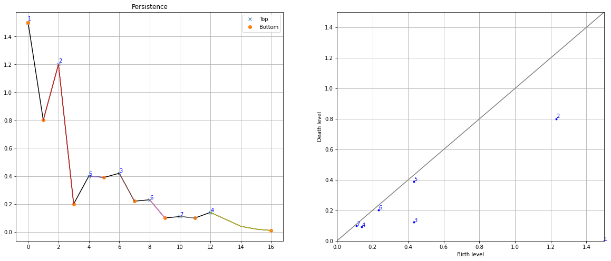
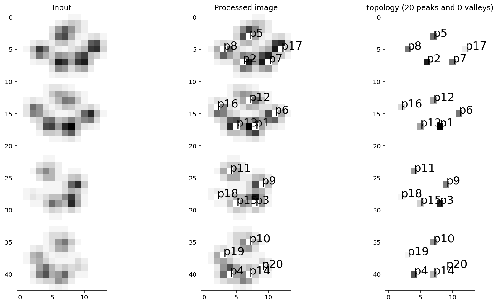
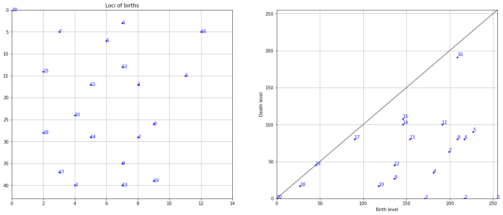

Plots
''''''''''''

This section provides comprehensive documentation of the visualization capabilities in the findpeaks library. The library offers rich plotting functionality for both 1D and 2D data analysis, including preprocessing visualization via :func:`findpeaks.findpeaks.findpeaks.plot_preprocessing`, persistence diagrams via :func:`findpeaks.findpeaks.findpeaks.plot_persistence`, and 3D mesh plots via :func:`findpeaks.findpeaks.findpeaks.plot_mesh`.

One-dimensional Plots
-------------------------------------

The findpeaks library provides specialized plotting functions for 1D data analysis, including preprocessing visualization and persistence diagrams using :func:`findpeaks.findpeaks.findpeaks.plot1d`.

Pre-processing visualization
''''''''''''''''''''''''''''''
The pre-processing visualization for 1D data is based on the interpolation function: :func:`findpeaks.interpolate.interpolate_line1d`. This allows users to visualize how interpolation affects the data before peak detection.

.. code:: python

    # Import library
    from findpeaks import findpeaks
    # Initialize with interpolation
    fp = findpeaks(method='topology', interpolate=2)
    # Import example
    X = fp.import_example("1dpeaks")
    # Detect peaks
    results = fp.fit(X)
    # Plot
    fp.plot()

.. |figP5| image:: ../figs/1dpeaks_interpolate.png

.. table:: Interpolation comparison: original data (left) vs interpolated data (right)
   :align: center

   +----------+----------+
   | |figP4|  | |figP5|  |
   +----------+----------+

Persistence diagram
'''''''''''''''''''''''

The persistence plot is generated using the function: :func:`findpeaks.findpeaks.findpeaks.plot_persistence`, and provides two complementary visualizations. The left plot shows detected peaks with their ranking (1=most significant), while the right plot displays the homology-persistence diagram. See the topology section for detailed explanations of persistence analysis.

.. code:: python

    # Plot persistence diagram
    fp.plot_persistence()

.. table:: Persistence Plot
   :align: center

   +----------+
   | |figP6|  |
   +----------+
   
   
Two-dimensional Plots
-------------------------------------

The findpeaks library provides comprehensive visualization tools for 2D data analysis, including preprocessing pipelines via :func:`findpeaks.findpeaks.findpeaks.plot_preprocessing`, detection results via :func:`findpeaks.findpeaks.findpeaks.plot2d`, and 3D mesh visualizations via :func:`findpeaks.findpeaks.findpeaks.plot_mesh`.

2D Pre-processing visualization
''''''''''''''''''''''''''''''''''
The pre-processing plot is specifically designed for 2D arrays (images) using the function: :func:`findpeaks.findpeaks.findpeaks.plot_preprocessing`. The plot dynamically adjusts the number of subplots based on the user-defined preprocessing steps, providing a clear visualization of each transformation.

.. code:: python

    # Import library
    from findpeaks import findpeaks
    # Initialize with peak detection only
    fp = findpeaks(method='topology', whitelist=['peak'])
    # Import example
    X = fp.import_example("2dpeaks")
    # Detect peaks
    results = fp.fit(X)
    # Plot preprocessing steps
    fp.plot_preprocessing()

.. |figP0| image:: ../figs/plot_example_norm.png

.. table:: Preprocessing pipeline visualization
   :align: center

   +----------+
   | |figP0|  |
   +----------+
   

The **plot** function :func:`findpeaks.findpeaks.findpeaks.plot` displays the three major analysis steps: 
    * Input data visualization
    * Final pre-processed image 
    * Peak detection results

.. code:: python

    # Plot comprehensive results
    fp.plot(figure_order='horizontal')

.. table:: Complete analysis results
   :align: center

   +----------+
   | |figP1|  |
   +----------+
   

Persistence diagram for 2D data
'''''''''''''''''''''''''''''''''''

The persistence plot for 2D data is generated using the function: :func:`findpeaks.findpeaks.findpeaks.plot_persistence`, and provides two complementary visualizations. The left plot shows detected peaks with their ranking (1=most significant), while the right plot displays the homology-persistence diagram. See the topology section for detailed explanations of persistence analysis.

.. code:: python

    # Plot persistence diagram
    fp.plot_persistence()

.. table:: Persistence Plot for 2D data
   :align: center

   +----------+
   | |figP2|  |
   +----------+

3D mesh visualization
'''''''''''''''''''''''

The mesh plot can be easily created using the function: :func:`findpeaks.findpeaks.findpeaks.plot_mesh`. It converts the 2D image data into an interactive 3D mesh visualization, providing enhanced spatial understanding of the data structure.

.. code:: python

    # Create 3D mesh plot
    fp.plot_mesh(rstride=1, cstride=1)
    # Rotate to create a top-down view
    fp.plot_mesh(view=(90,0), rstride=1, cstride=1)

.. |figP7| image:: ../figs/2dpeaks_mesh1_norm.png
.. |figP8| image:: ../figs/2dpeaks_mesh2_norm.png
.. |figP9| image:: ../figs/2dpeaks_mesh3_norm.png
.. |figP10| image:: ../figs/2dpeaks_mesh4_norm.png

.. table:: 3D mesh visualization: 3D perspective (top) and top-down view (bottom)
   :align: center

   +----------+----------+
   | |figP7|  | |figP8|  |
   +----------+----------+
   | |figP9|  | |figP10| |
   +----------+----------+

.. include:: add_bottom.add