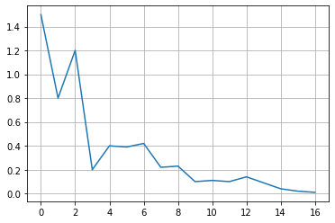
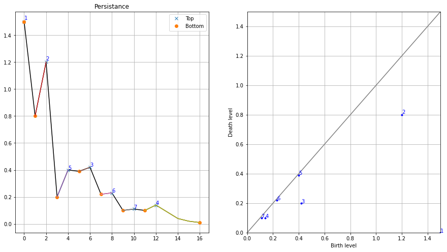
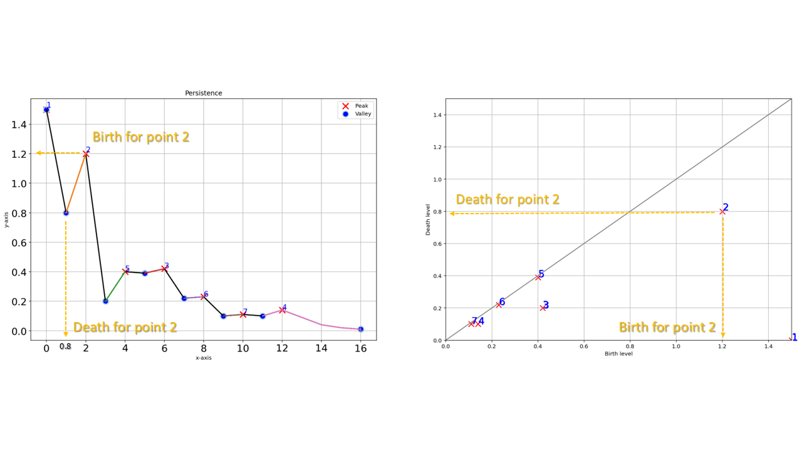
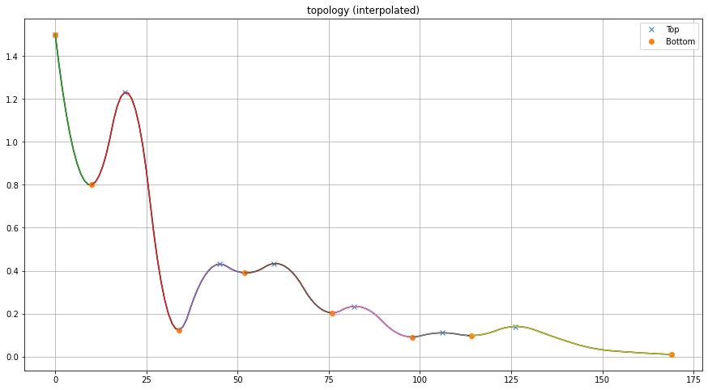

.. _code_directive:

-------------------------------------

Some of the explanations of **topology**, and **persitent homology** are gathered from various sources on the internet (articles, stackoverflow, blog pages, and git pages), and combined on this page.
All references are depicted at the bottom of the page. Note that all examples are made with ``findpeaks``.
The function with docstrings for the topology method can be found here :func:`findpeaks.utils.stats.topology`.

Topology
''''''''''
Topological data analysis (TDA) applies methods of topology in data analysis and found many applications in data science[1].
TDA builds upon the observation that data often possesses a certain intrinsic shape such as the shape of a point cloud, the shape of a signal or the shape of a geometric object.
Persistent homology is probably the most prominent tool in TDA that gives us the means to describe and quantify topological properties of these shapes [1].

persistent homology
----------------------
In computational topology the idea of persistent homology leads to an efficient – fast as sorting numbers – solution.
It does not only detect peaks, it quantifies the "significance" of the peaks in a natural way that allows you to select the peaks that are significant for you[2].
The idea of persistent homology is intuitive: Consider the function graph of the function that assigns each pixel its level. It looks like this:

.. code:: python

    # Import library
    from findpeaks import findpeaks
    # Initialize
    fp = findpeaks(method='topology')
    # Example 1d-vector
    X = fp.import_example('1dpeaks')
    # Plot
    plt.plot(X); plt.grid(True)

.. _Figure_1:

Now consider a water level that continuously descents to lower levels.
At local maxima islands pop up (birth). At saddle points two islands merge; we consider the lower island to be merged to the higher island (death).
The so-called persistence diagram (of the 0-th dimensional homology classes, our islands) depicts death- over birth-values of all islands:

.. code:: python

    # Fit topology method on the 1d-vector
    results = fp.fit(X)
    # Plot the results
    fp.plot_persistence()

.. _Figure_2:

The persistence of an island is then the difference between the birth-level and death-level; the vertical distance of a dot to the grey main diagonal. The figure labels the islands by decreasing persistence.
The right figure shows the locations of births of the islands. This method not only gives the local maxima but also quantifies their "significance" by the above mentioned persistence.
One would then filter out all islands with a too low persistence, i.e. those at the diagonal.

.. _Figure_2a:

Efficiency
-----------
The topology method is implementated in such a manner that it runs in linear time – in fact it is a single, simple loop – after the function values were sorted. The time complexity is **O(n log n)**.
So this implementation should be fast in practice and is easily implemented. The original implementation was in Python 2.7 [4], but in ``findpeaks`` it is (slightly) adjusted and rewritten for python 3.

One-dimensional
----------------------------------------------------

The initialization with contains many variables for which only a few are applicable for the **topology** method.
The general parameters are *figsize* and *verbose* which are for setting the figure size and printing messages to the screen.
Specific for the topology method, the method should be set at "topology", and in addition, the parameters *interpolate* and *limit* can be used for some pre-processing, and output adjustments.
By default, no interpolation is applied and there is no limit on the final results. See here for the details :func:`findpeaks.findpeaks.findpeaks`

.. code:: python

    # Import library
    from findpeaks import findpeaks
    # Initialize
    fp = findpeaks(method='topology', interpolate=None, limit=None, figsize=(15, 8), verbose=3)
    # Fit topology method on the 1d-vector
    results = fp.fit(X)
    # The output contains multiple variables
    print(results.keys())
    # dict_keys(['persistence', 'Xdetect', 'Xranked', 'groups0', 'df'])

The output is a dictionary containing multiple variables that can be of use for follow-up analysis. See: :func:`findpeaks.findpeaks.findpeaks.peaks1d`
Note that this DataFrame is *NOT* filtered on *limit* variable as it should be in line with the input dataset.

.. code:: python

    # Print results to screen
    print(results['df'])

    +----+-----+------+--------+--------+---------+----------+--------+
    |    |   x |    y |   labx |   rank |   score | valley   | peak   |
    +====+=====+======+========+========+=========+==========+========+
    |  0 |   0 | 1.5  |      1 |      1 |    1.5  | True     | True   |
    +----+-----+------+--------+--------+---------+----------+--------+
    |  1 |   1 | 0.8  |      2 |      0 |    0    | True     | False  |
    +----+-----+------+--------+--------+---------+----------+--------+
    |  2 |   2 | 1.2  |      2 |      2 |    0.4  | False    | True   |
    +----+-----+------+--------+--------+---------+----------+--------+
    |  3 |   3 | 0.2  |      3 |      0 |    0    | True     | False  |
    +----+-----+------+--------+--------+---------+----------+--------+
    |  4 |   4 | 0.4  |      3 |      0 |    0    | False    | False  |
    +----+-----+------+--------+--------+---------+----------+--------+
    |  5 |   5 | 0.39 |      3 |      0 |    0    | False    | False  |
    +----+-----+------+--------+--------+---------+----------+--------+
    |  6 |   6 | 0.42 |      3 |      3 |    0.22 | False    | True   |
    +----+-----+------+--------+--------+---------+----------+--------+
    |  7 |   7 | 0.22 |      3 |      0 |    0    | False    | False  |
    +----+-----+------+--------+--------+---------+----------+--------+
    |  8 |   8 | 0.23 |      3 |      0 |    0    | False    | False  |
    +----+-----+------+--------+--------+---------+----------+--------+
    |  9 |   9 | 0.1  |      3 |      0 |    0    | False    | False  |
    +----+-----+------+--------+--------+---------+----------+--------+
    | 10 |  10 | 0.11 |      3 |      0 |    0    | False    | False  |
    +----+-----+------+--------+--------+---------+----------+--------+
    | 11 |  11 | 0.1  |      4 |      0 |    0    | True     | False  |
    +----+-----+------+--------+--------+---------+----------+--------+
    | 12 |  12 | 0.14 |      4 |      4 |    0.04 | False    | True   |
    +----+-----+------+--------+--------+---------+----------+--------+
    | 13 |  13 | 0.09 |      4 |      0 |    0    | False    | False  |
    +----+-----+------+--------+--------+---------+----------+--------+
    | 14 |  14 | 0.04 |      4 |      0 |    0    | False    | False  |
    +----+-----+------+--------+--------+---------+----------+--------+
    | 15 |  15 | 0.02 |      4 |      0 |    0    | False    | False  |
    +----+-----+------+--------+--------+---------+----------+--------+
    | 16 |  16 | 0.01 |      4 |      0 |    0    | True     | False  |
    +----+-----+------+--------+--------+---------+----------+--------+

For the homology-persistence, the dataframe **persistence** contains: 
    * x, y    : coordinates
    * birth   : Birth level
    * death   : Death level 
    * score   : persistence scores

.. code:: python

    # Print results to screen
    print(results['persistence'])

    +----+-----+------+---------------+---------------+-----------+
    |    |   x |    y |   birth_level |   death_level |   score   |
    +====+=====+======+===============+===============+===========+
    |  0 |   0 | 1.5  |          1.5  |          0    |    1.5    |
    +----+-----+------+---------------+---------------+-----------+
    |  1 |   2 | 1.2  |          1.2  |          0.8  |    0.4    |
    +----+-----+------+---------------+---------------+-----------+
    |  2 |   6 | 0.42 |          0.42 |          0.2  |    0.22   |
    +----+-----+------+---------------+---------------+-----------+
    |  3 |  12 | 0.14 |          0.14 |          0.1  |    0.04   |
    +----+-----+------+---------------+---------------+-----------+
    |  4 |   4 | 0.4  |          0.4  |          0.39 |    0.0101 |
    +----+-----+------+---------------+---------------+-----------+
    |  5 |   8 | 0.23 |          0.23 |          0.22 |    0.0101 |
    +----+-----+------+---------------+---------------+-----------+
    |  6 |  10 | 0.11 |          0.11 |          0.1  |    0.0099 |
    +----+-----+------+---------------+---------------+-----------+

The input-parameter *limit* will filter the results based on the score, and keep only those with **score>limit**.
Limiting becomes very usefull when the data is noisy and many peaks are detected along the diagonal.
Lets set *limit* at 0.0101 and checkout the results:

.. code:: python

    fp = findpeaks(method='topology', interpolate=None, limit=0.0101, verbose=5)
    results = fp.fit(X)
    # Print results to screen
    print(results['persistence'])

    +----+-----+------+---------------+---------------+-----------+
    |    |   x |    y |   birth_level |   death_level |   score   |
    +====+=====+======+===============+===============+===========+
    |  0 |   0 | 1.5  |          1.5  |          0    |    1.5    |
    +----+-----+------+---------------+---------------+-----------+
    |  1 |   2 | 1.2  |          1.2  |          0.8  |    0.4    |
    +----+-----+------+---------------+---------------+-----------+
    |  2 |   6 | 0.42 |          0.42 |          0.2  |    0.22   |
    +----+-----+------+---------------+---------------+-----------+
    |  3 |  12 | 0.14 |          0.14 |          0.1  |    0.04   |
    +----+-----+------+---------------+---------------+-----------+

The input parameter "interpolate" extens the data by this factor and is usefull to "smooth" the signal by a linear interpolation.
A smoothed signal can be more robust agains noise, and perform better in the detection of peaks and valleys. This step can be seen as pre-processing step before applying any method.
The results are based on the *interpolated data*, and mapped *back* to the original input data.
In this use-case, the results are very similar as no-interpolation. However, the persistence scores are slightly different.

Lets demonstrate by example:

.. code:: python

    # Import library
    from findpeaks import findpeaks
    # Initialize with interpolation
    fp = findpeaks(method='topology', interpolate=10, limit=None)
    # Fit topology method on the interpolated 1d-vector
    results = fp.fit(X)
    # The results in the original dataframe
    results['df']
    # The results for the interpolated data.
    results['df_interp']

    # Thet output vector is 10 times longer then the input, we expect 170 rows.
    +----+-----+---------+--------+--------+---------+----------+--------+
    |    |   x |       y |   labx |   rank |   score | valley   | peak   |
    +====+=====+=========+========+========+=========+==========+========+
    |  0 |   0 | 1.5     |      1 |      1 |     1.5 | True     | True   |
    +----+-----+---------+--------+--------+---------+----------+--------+
    |  1 |   1 | 1.36189 |      1 |      0 |     0   | False    | False  |
    +----+-----+---------+--------+--------+---------+----------+--------+
    |  ..|  .. | ...     |    ..  |     .. |    ..   | ...      | ...    |
    +----+-----+---------+--------+--------+---------+----------+--------+
    | 168|   3 | 0.0107  |      7 |      0 |     0   | False    | False  |
    +----+-----+---------+--------+--------+---------+----------+--------+
    | 169|   4 | 0.0100  |      7 |      0 |     0   | True    | False   |
    +----+-----+---------+--------+--------+---------+----------+--------+
    

.. |fig4| image:: ../figs/1dpeaks_interpolation_pers.png

.. table:: Interpolated data with topology method. Results are mapped to the original input data.
   :align: center

   +---------+---------+
   | |fig3|  | |fig4|  |
   +---------+---------+
   

Two-dimensional
----------------------------------------------------

The 2d-detection peaks persistent homology for 2D images runs through the same function as the 1d-vector.
The implementation uses a union-find data structure instead of the more efficient implemention used for one-dimensional data.
However, there is a differences in the pre-processing steps. Both peaks and valleys are detected with the topology method. The detection of valleys is however by first negating the input image and then finding the "peaks". The valleys are stored in the output as negative values.

The initialization with contains many variables for which only *limit* is applicable for the **topology** method for *2d-peak* detection.
However, there are few parameters that can be used to control the pre-processing steps, such as:
    * togray
    * imsize
    * scale
    * denoise
    * window
    * cu

The docstring provide the information regarding the input/output parameters: :func:`findpeaks.findpeaks.findpeaks.peaks2d`.

.. code:: python

    # Import library
    from findpeaks import findpeaks
    # Initialize
    fp = findpeaks(method='topology')
    # Example 2d image
    X = fp.import_example('2dpeaks')
    # Fit topology method on the 1d-vector
    results = fp.fit(X)
    # The output contains multiple variables
    print(results.keys())
    # dict_keys(['Xraw', 'Xproc', 'Xdetect', 'Xranked', 'persistence', 'groups0'])

The output is a dictionary containing multiple variables that can be of use for follow-up analysis. Note thet output is slighty different to that of the 1d-vector. Details about the input/output parameters can be found here: :func:`findpeaks.findpeaks.findpeaks.peaks2d`
The output variables **Xdetect** and **Xranked** is in the same shape as the input image and contains the detected peaks/valleys (high=best peak and low=best valley). The key **persistence** is a dataframe containing the x,y coordinates and more information about the peaks/valleys. See api-docstrings for more information.

Plot the image with the detected peaks:

.. code:: python

    # Import library
    fp.plot()

.. _Figure_5:

.. figure:: ../figs/2dpeaks.png

Plot the image with the persistence. Note that the left-bottom figure is the same as the top-right figure.

.. code:: python

    # Import library
    fp.plot_persistence()
    
.. _Figure_6:

.. figure:: ../figs/2dpeaks_peristence.png

References
-----------
* [1] Persistent Homology in Data Science, Proc. 3rd Int. Data Sci. Conf. (iDSC '20)
* [2] https://stackoverflow.com/questions/22583391/peak-signal-detection-in-realtime-timeseries-data/46680769#46680769
* [3] https://www.sthu.org/code/codesnippets/imagepers.html
* [4] https://git.sthu.org/?p=persistence.git
* [5] H. Edelsbrunner and J. Harer, Computational Topology. An Introduction, 2010, ISBN 0-8218-4925-5.

