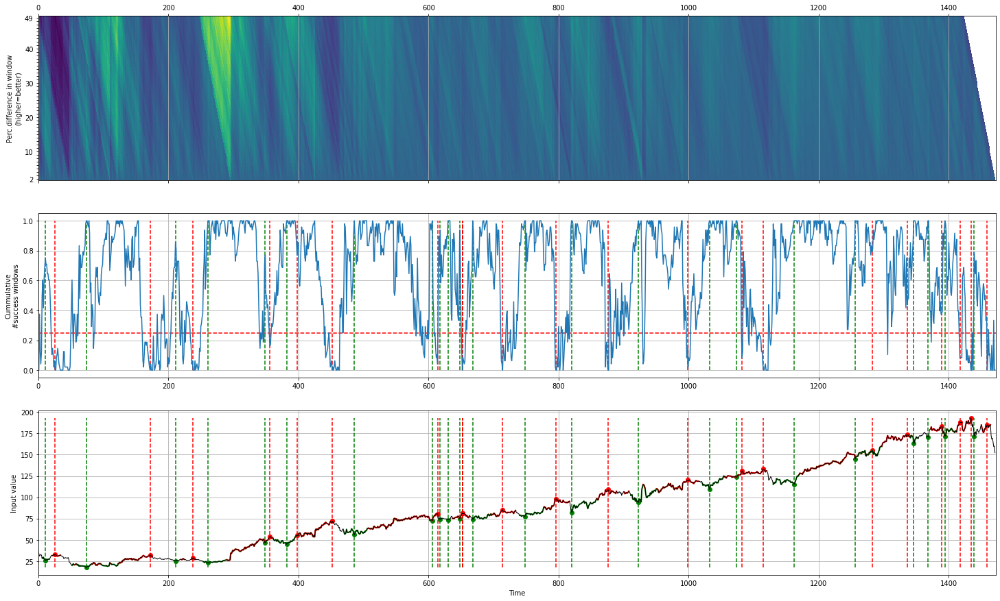
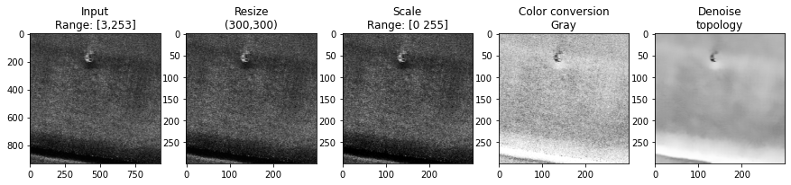
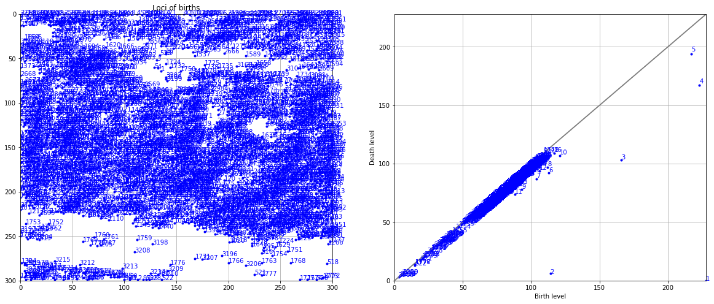

Stock Markets
''''''''''''''

The detection of peaks and valleys in stockmarket data can be challanging because of its unpredictable behavior.
The use of peak detection techniques such as topology require a very specific set of input parameters and seem only to work for certain timeframes, scales, or trends (bull/bear/sideways) in the market.

To overcome these challanges, I developed the method ``Caerus`` and incorporated it in ``findpeaks``.
``Caerus`` is a python package (https://github.com/erdogant/caerus) that determines the local-minima with the corresponding local-maxima within the given time-frame.

Bitcoin
^^^^^^^^^^^^^^^^

.. code:: python

    # Import library
    from findpeaks import findpeaks
    # Initialize findpeaks with cearus method.
    # The default setting is that it only return peaks-vallyes with at least 5% difference. We can change this using params
    fp = findpeaks(method='caerus', params={'minperc':10})
    # Import example data
    X = fp.import_example('btc')
    # Fit
    results = fp.fit(X)
    # Make the plot
    fp.plot()

.. |fig_btc_minperc5| image:: ../figs/btc_minperc5.png

.. table:: Detection of peaks and valleys
   :align: center

   +--------------------+
   | |fig_btc_minperc5| |
   +--------------------+

Lets print out some of the detected results:

.. code:: python

    # Results
    print(fp.results['df'])

    # index labx   peak  valley         y     x
    # 0        0  False   False     5.970     0
    # 1        0  False   False     5.530     1
    # 2        0  False   False     5.130     2
    # 3        0  False   False     4.850     3
    # 4        0  False   False     4.870     4
    #    ...    ...     ...       ...   ...
    # 2517     0  False   False  7010.800  2517
    # 2518     0  False   False  7028.705  2518
    # 2519     0  False   False  6937.055  2519
    # 2520     0  False   False  6718.060  2520
    # 2521     0  False   False  6265.215  2521

    # Number of peaks
    print(fp.results['df']['peak'].sum())
    # 36
    # Number of valleys
    print(fp.results['df']['valley'].sum())
    # 39

Facebook stocks
^^^^^^^^^^^^^^^^

.. code:: python

	# Import library
	from findpeaks import findpeaks
	# Initialize findpeaks with cearus method.
	# The default setting is that it only return peaks-vallyes with at least 5% difference. We can change this using params
	fp = findpeaks(method='caerus')
	# Import example data
	X = fp.import_example('facebook')
	# Fit
	results = fp.fit(X)
	# Make the plot
	fp.plot()

SAR
''''''''''

*SAR* images are affected by *speckle* noise that inherently exists in and which degrades the image quality.
It is caused by the back-scatter waves from multiple distributed targets. It is locally strong and it increases the mean Grey level of local area.
Reducing the noise enhances the resolution but tends to decrease the spatial resolution too.

SAR images are corrupted by speckle noise which makes peak detection very challenging or somethimes not even possible.
Let's load a SAR image, apply denoising techniques and then detect peaks.

.. code:: python

    # Import library
    from findpeaks import findpeaks
    # Initializatie
    fp = findpeaks(scale=None, denoise=None, togray=True, imsize=(300, 300))
    # Import image example
    img = fp.import_example('2dpeaks_image')
    # Fit
    fp.fit(img)
    # Thousands of peaks are detected at this point.
    fp.plot(figure_order='horizontal')
    fp.plot_mesh()

.. |figU9| image:: ../figs/sonar_plot_no_preprocessing.png
.. |figU10| image:: ../figs/sonar_mesh_no_preprocessing.png

.. table:: Results without pre-processing
   :align: center

   +----------+
   | |figU9|  |
   +----------+
   | |figU10| |
   +----------+

From this point on, we will *pre-process* the image and apply the *topology* method for peak detection.

.. code:: python

    # Import library
    from findpeaks import findpeaks
    # Import image example
    img = fp.import_example('2dpeaks_image')
    # Initializatie
    fp = findpeaks(method='topology', limit=160, scale=True, togray=True, imsize=(150, 150), denoise='lee_sigma', params={'window': 17})
    # Fit
    fp.fit(img)
    
At this point, the image is pre-processed and the peaks are detected. First we will examine the results by looking at the pre-processing steps.
Below are depicted the four steps of pre-processing. Note that all images are colored in the same manner but the first three look different because RGB colors are used.
The final denoised picture does show clear removal of the speckle noise. But is it good enough to detect the correct peaks?

.. code:: python

    # Plot
    fp.plot_preprocessing()

.. table:: Pre-processing SAR image
   :align: center

   +----------+
   | |figU0|  |
   +----------+
   

In the next step, we can examine the detected peaks (see below). But these peaks are barely visible on the plot. Nevertheless, we seem to removed many peaks compared to the not-preprocessed image.

.. code:: python

    # Plot
    fp.plot(figure_order='horizontal')

.. |figU1| image:: ../figs/sonar_plot.png

.. table:: Detected peaks
   :align: center

   +----------+
   | |figU1|  |
   +----------+

The detection of peaks and pre-processing steps becomes clear when we create a 3D mesh plot.
The image clearly shows that the denoising was very effective in reducing the speckle noise and keeping the peak of interest.

.. code:: python

    # Plot
    fp.plot_mesh()
    # Rotate to make a top view
    fp.plot_mesh(view=(90,0))

.. |figU3| image:: ../figs/sonar_mesh1.png
.. |figU4| image:: ../figs/sonar_mesh2.png
.. |figU5| image:: ../figs/sonar_mesh3.png
.. |figU6| image:: ../figs/sonar_mesh4.png

.. table:: Mesh plot. Top: 3D mesh. Bottom: top view.
   :align: center

   +----------+----------+
   | |figU3|  | |figU4|  |
   +----------+----------+
   | |figU5|  | |figU6|  |
   +----------+----------+
   
A deep examination can be done with the persistence-homology plot. See below the code how to do this.
Even after denoising, we detect many peaks along the diagonal which are not of interest (see topology section for more information). Only 5 points are potential peaks of interest.
But this information allows to limit the model, and focus only on the peaks that that are off the diagonal.

.. code:: python

    # Plot
    fp.plot_persistence()

    # Plot the top 15 peaks that are detected and examine the scores
    fp.results['persistence'][1:10]

    +----+-----+-----+---------------+---------------+---------+
    |    |   x |   y |   birth_level |   death_level |   score |
    +====+=====+=====+===============+===============+=========+
    |  0 |  64 | 228 |           228 |             0 |     228 |
    +----+-----+-----+---------------+---------------+---------+
    |  1 | 299 | 114 |           114 |             6 |     108 |
    +----+-----+-----+---------------+---------------+---------+
    |  2 |  52 | 166 |           166 |           103 |      63 |
    +----+-----+-----+---------------+---------------+---------+
    |  3 |  61 | 223 |           223 |           167 |      56 |
    +----+-----+-----+---------------+---------------+---------+
    |  4 |  60 | 217 |           217 |           194 |      23 |
    +----+-----+-----+---------------+---------------+---------+
    |  5 | 288 | 113 |           113 |            92 |      21 |
    +----+-----+-----+---------------+---------------+---------+
    |  6 | 200 | 104 |           104 |            87 |      17 |
    +----+-----+-----+---------------+---------------+---------+
    |  7 | 293 | 112 |           112 |            97 |      15 |
    +----+-----+-----+---------------+---------------+---------+
    |  8 | 110 |  93 |            93 |            78 |      15 |
    +----+-----+-----+---------------+---------------+---------+
    |  9 |  45 | 121 |           121 |           107 |      14 |
    +----+-----+-----+---------------+---------------+---------+

    # Take the minimum score for the top peaks off the diagonal.
    limit = fp.results['persistence'][0:5]['score'].min()
    # Initializatie findpeaks again but now with the limit parameter
    fp_new = findpeaks(scale=True, denoise='fastnl', window=31, togray=True, imsize=(300,300), limit=limit)
    # Fit
    fp_new.fit(img)
    # Plot
    fp_new.plot_persistence()

.. |figU8| image:: ../figs/sonar_persitence_limit.png

.. table:: persistence-homology. Top: no limit. Bottom: with limit
   :align: center

   +----------+
   | |figU7|  |
   +----------+
   | |figU8|  |
   +----------+

The final results show that peak-detection for SAR images is possible using a emperical approach.

Denoising
^^^^^^^^^^

.. code:: python

	from findpeaks import findpeaks
	fp = findpeaks(limit=160)
	img = fp.import_example('2dpeaks_image')
	import findpeaks

	# Some pre-processing
	# Resize
	img = findpeaks.stats.resize(img, size=(300,300))
	# Make grey image
	img = findpeaks.stats.togray(img)
	# Scale between [0-255]
	img = findpeaks.stats.scale(img)

	# filters parameters
	# window size
	winsize = 31
	# damping factor for frost
	k_value1 = 2.0
	# damping factor for lee enhanced
	k_value2 = 1.0
	# coefficient of variation of noise
	cu_value = 0.25
	# coefficient of variation for lee enhanced of noise
	cu_lee_enhanced = 0.523
	# max coefficient of variation for lee enhanced
	cmax_value = 1.73

	# Denoising
	# fastnl
	img_fastnl = findpeaks.stats.denoise(img.copy(), method='fastnl', window=winsize)
	# bilateral
	img_bilateral = findpeaks.stats.denoise(img.copy(), method='bilateral', window=winsize)
	# frost filter
	image_frost = findpeaks.frost_filter(img.copy(), damping_factor=k_value1, win_size=winsize)
	# kuan filter
	image_kuan = findpeaks.kuan_filter(img.copy(), win_size=winsize, cu=cu_value)
	# lee filter
	image_lee = findpeaks.lee_filter(img.copy(), win_size=winsize, cu=cu_value)
	# lee enhanced filter
	image_lee_enhanced = findpeaks.lee_enhanced_filter(img.copy(), win_size=winsize, k=k_value2, cu=cu_lee_enhanced, cmax=cmax_value)
	# lee sigma filter
	image_lee_sigma = findpeaks.stats.lee_sigma_filter(img.copy(), win_size=winsize)
	# mean filter
	image_mean = findpeaks.mean_filter(img.copy(), win_size=winsize)
	# median filter
	image_median = findpeaks.median_filter(img.copy(), win_size=winsize)

Plots
^^^^^^^^^^^^^^^^^^^^^^^^^^^^^^^^^^^^ 

.. code:: python

	import matplotlib.pyplot as plt
	plt.figure(); plt.imshow(img_fastnl, cmap='gray'); plt.title('Fastnl'); plt.grid(False)
	plt.figure(); plt.imshow(img_bilateral, cmap='gray'); plt.title('Bilateral')
	plt.figure(); plt.imshow(image_frost, cmap='gray'); plt.title('Frost')
	plt.figure(); plt.imshow(image_kuan, cmap='gray'); plt.title('Kuan')
	plt.figure(); plt.imshow(image_lee, cmap='gray'); plt.title('Lee')
	plt.figure(); plt.imshow(image_lee_enhanced, cmap='gray'); plt.title('Lee Enhanced')
	plt.figure(); plt.imshow(image_lee_sigma, cmap='gray'); plt.title('Lee Sigma')
	plt.figure(); plt.imshow(image_mean, cmap='gray'); plt.title('Mean')
	plt.figure(); plt.imshow(image_median, cmap='gray'); plt.title('Median')

Find peaks on the denoised image
^^^^^^^^^^^^^^^^^^^^^^^^^^^^^^^^^^^^ 

.. code:: python

	from findpeaks import findpeaks
	fp = findpeaks(scale=False, denoise=None, togray=False, imsize=False)
	fp.fit(image_lee_sigma)
	fp.plot_persistence()
	fp.plot_mesh(wireframe=False, title='Lee Sigma')

    

.. include:: add_bottom.add